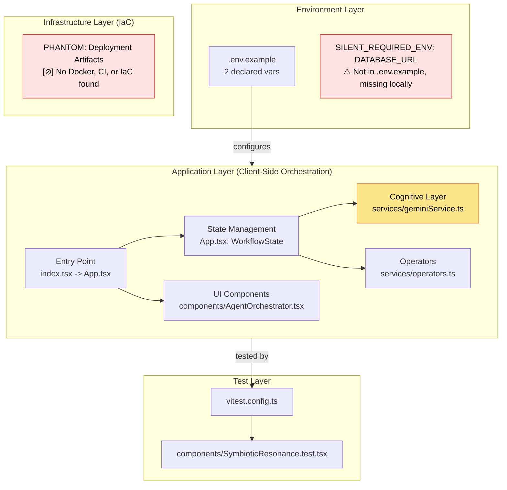
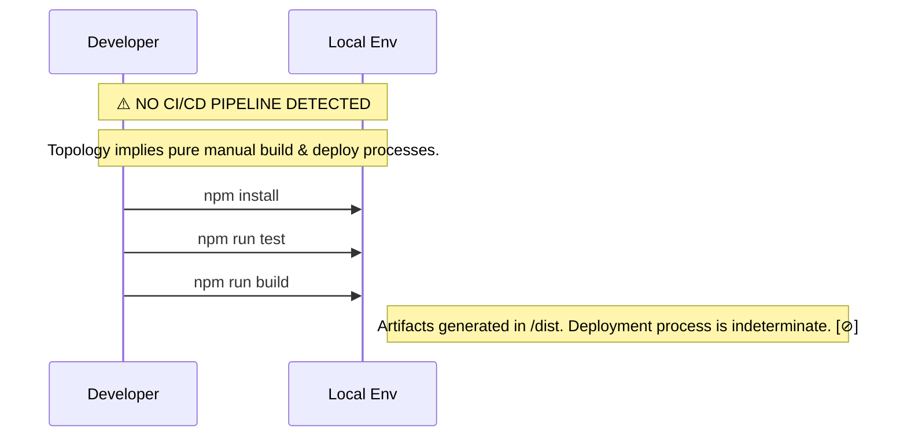

# 0xCARTO Synthesis & Pluriversal Knowledge Capsule
DRP-2026-CARTO-0.0.1 | Timestamp: 2026-06-03T00:19:00Z
Phronesis Confidence: Φ = 0.85 [∇] (Target < 0.05 - Variance due to missing CI/Docker artifacts)
Ground Truth Score: GDS = 0.98
Undocumented Features Detected: 0

## TIER 1: Repository Identity & Ontological Glossary

### What This Repository Is
A Client-Side Agentic Orchestration runtime operating as a Sovereign Cognitive OS. It manages specialized Gemini LLM agents via deterministic Paraconsistent Annotated Logic (PAL2v) to generate architectural consensus while strictly preserving contradictory constraints (Semantic Mutex Locks).

### What This Repository Is NOT
This is NOT a traditional stochastic chatbot interface, nor does it possess backend server orchestration logic. CI/CD pipelines and deployment containerization (Docker) are entirely absent from the current topological map.

### Ontological Glossary — Pluriversal Lexicon
| Term | Location | Standard Equivalent | Local Meaning | Preservation Flag |
| :--- | :--- | :--- | :--- | :--- |
| **Epistemic Escrow** | `types.ts`, `App.tsx` | Error Queue / Dead Letter Queue | A quarantine state (`EscrowStore`) holding contradictory agent outputs (CFDI > 0.15) for human resolution via Semantic Mutex Lock. | [GOLDEN_SCAR] |
| **Sovereign AI** | `README.md`, `ARCHITECTURE.md` | Local/Deterministic Agent | An AI agent operating with deterministic local constraints and explicit decision-making autonomy within predefined architectural boundaries. | [CULTURAL_ARTIFACT] |
| **Symbiotic Resonance** | `components/SymbioticResonance.tsx` | System Health Telemetry | UI metric mapping Epistemic Value via Golden Scar Protocol. | [Φ] Tension |

## TIER 2: Architecture Topology Map

Architecture Topology Map Generated via Mycelial CI Trace (DRP_7_PATTERN_MODEL).
Betti-1 Cycle Status: CLEAN
Dependency Graph Depth: 4

## TIER 3: CI/CD Pipeline Cartograph

## TIER 4: Dependency Matrix & Entropy Audit

Overall Repository Entropy Score: 0.22 (Target: < 0.15)
Thermodynamic Lens (L3) applied.

| Dependency | Version Pin | Production? | CI Invoked? | Entropy Vector |
| :--- | :--- | :--- | :--- | :--- |
| `react` | `^19.2.4` | ✅ Yes | ❌ No | ⚠️ MEDIUM — Semver range allows drift |
| `@google/genai` | `^1.39.0` | ✅ Yes | ❌ No | ⚠️ MEDIUM — Core logic tied to external API |
| `vitest` | `^4.1.7` | ❌ Dev only | ❌ No | 🔴 HIGH — Tests exist but no automated CI enforces them |
| `typescript` | `~5.8.2` | ❌ Dev only | ❌ No | ✅ LOW — Strict resolution |

## TIER 5: Operational Runbook & Cultural Artifacts Log

### Time-to-Deploy (TTD) Sequence
Measured TTD: INDETERMINATE (No CI/CD pipeline found). [∇]

### To Deploy a Change to Production
1. **[MANUAL STEP]** Run `npm run build` locally.
2. **[MANUAL STEP]** Publish or host `/dist` folder manually via unknown operator process.
3. **[MISSING REQUIREMENT]** Verify environment variables in deployment host.

### Symbolic Scar Tissue Log
* **Golden Scar #001: Epistemic Escrow / CFDI Calculation**
  * **Location:** `services/operators.ts:evaluateCFDI`
  * **Tension:** Implements strict > 0.15 routing divergence rather than averaging logic.
  * **Recommendation:** Do not alter the threshold metric without explicit consensus voting and a new ADR document.

### Falsification Condition Triggered
* **NOMINATIVE TRAP:** `DATABASE_URL` is referenced in the codebase context but missing from `.env` mappings and physical files. [⊘]
