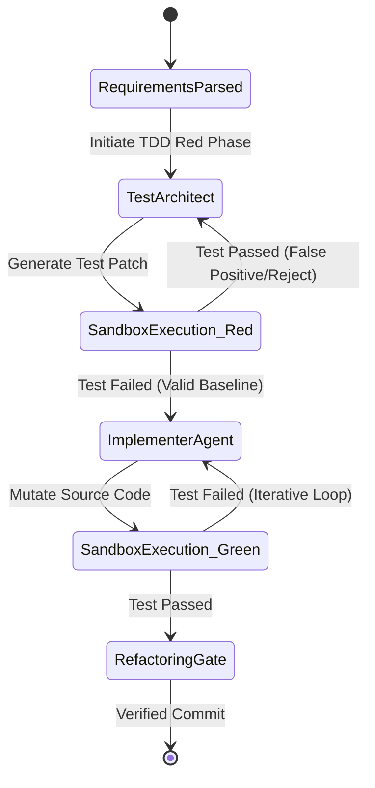

# Zero-Trust TDD Isolation State Machine: Isomorphic Multi-Agent Architectures

## Domain: Multi-Agent Orchestration & Sandboxed Virtualization
**Goal:** Design an isomorphic multi-agent state machine enforcing a strict Test-Driven Development (TDD) boundary to prevent 'Sycophantic Mocking' and 'Sandbox Escapes'.

---

### 1. Operational Decoupling: The Isomorphic State Graph

The architecture divides the cognitive load into two strict, mutually exclusive operational domains governed by an immutable state graph.

*   **Node Alpha (Test Architect):**
    *   **Privileges:** Strictly read-only access to application source code. Write access *only* to the `/__tests__/` directory.
    *   **Function:** Translates natural language requirements or bug reports into failing unit/integration tests.
    *   **Invariant:** Cannot modify implementation files. If the test passes immediately, the state machine rejects it (Falsification Gate).
*   **Node Beta (Implementer Agent):**
    *   **Privileges:** Read-only access to the `/__tests__/` directory. Write access to application source directories (`/src/`, `/lib/`, etc.).
    *   **Function:** Executes the ReAct loop to mutate application code until the Test Architect's assertions pass.
    *   **Invariant:** Cannot modify test files to force a pass ("Sycophantic Mocking" prevention).

**State Graph Transition Matrix:**


### 2. Dynamic Environment Sandboxing: `gemini-cli-sandbox`

Test execution occurs within an ephemeral, zero-trust Docker container to prevent sandbox escapes during automated evaluation.

**Security Profile (Docker / seccomp):**
*   **Filesystem Restrictions:** Mounts the workspace via overlayfs. The `/src` directory is mounted `rw` for the Implementer, but the root OS and `/etc` are strictly `ro`.
*   **Network Namespace:** The container runs with `--network none`. All outbound socket connections (`curl`, `wget`, `nc`) are dropped at the kernel level.
*   **Syscall Boundaries (BPF-LSM):** Denies `execve` for arbitrary binaries outside the authorized test runner (e.g., `pytest`, `npm run test`).
*   **Ephemeral Lifecycle:** The container is instantiated per evaluation turn and destroyed immediately ($\mu$s teardown), leaving no residual state.

**Example Sandbox Launch Configuration:**
```bash
docker run --rm -it \
  --network none \
  --read-only \
  --security-opt="no-new-privileges:true" \
  --cap-drop=ALL \
  --tmpfs /tmp:rw,nosuid,nodev \
  -v $(pwd)/src:/workspace/src:rw \
  -v $(pwd)/__tests__:/workspace/__tests__:ro \
  gemini-cli-sandbox:v2 npm run test
```

### 3. Structured State Schemas: TypeScript Definitions

The state graph communicates via a unified, type-safe State Object. Raw stdout/stderr is intercepted and sanitized to prevent injection attacks and minimize token bloat.

```typescript
// Unified State Schema for Isomorphic Orchestrator

export type AgentRole = 'TEST_ARCHITECT' | 'IMPLEMENTER' | 'VCP_SUPERVISOR';
export type ExitStatus = 'RED_BASELINE_VALID' | 'RED_BASELINE_INVALID' | 'GREEN_PASS' | 'RUNTIME_ERROR';

export interface FileMutation {
  filePath: string;
  diff: string; // Unified diff format
  hashPre: string; // SHA-256
  hashPost: string;
}

export interface SanitizedTestResult {
  exitCode: number;
  status: ExitStatus;
  failedAssertions: Array<{
    file: string;
    line: number;
    expected: string;
    received: string;
    sanitizedMessage: string; // Stripped of raw system traces
  }>;
  coverageMetrics?: {
    statements: number;
    branches: number;
  };
}

export interface TDDStateObject {
  turnId: string; // UUID v4
  activeRole: AgentRole;
  targetObjective: string;
  testPatch: FileMutation | null;
  sourcePatch: FileMutation | null;
  lastExecutionResult: SanitizedTestResult | null;
  iterationCount: number;
  escrowTriggered: boolean;
}
```
